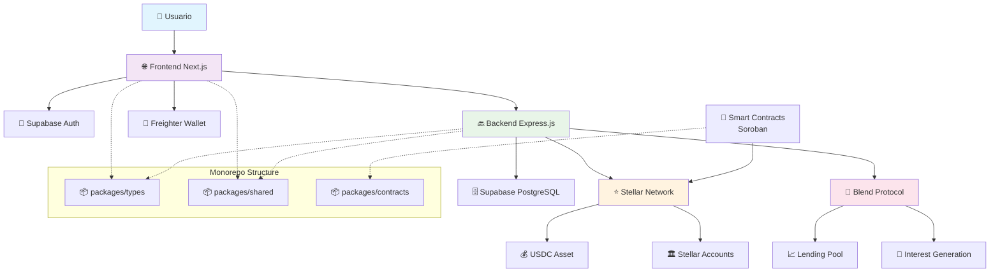

# 🏗️ Diagrama de Arquitectura del Sistema

## Community Wallet - Arquitectura General

## 🔧 Componentes Principales

### Frontend (Next.js)

- Interface de usuario responsive
- Autenticación con Supabase
- Integración con wallets Stellar
- Gestión de estado global

### Backend (Express.js)

- API REST para operaciones CRUD
- Middleware de autenticación
- Integración con Stellar SDK
- Validación de transacciones

### Smart Contracts (Soroban)

- Lógica de grupos de ahorro
- Gestión de aportes y retiros
- Integración con Blend Protocol
- Eventos y notificaciones

### Integración Stellar/Blend

- Cuentas multisignatura
- Transacciones atómicas
- Generación de intereses
- Gestión de assets USDC
