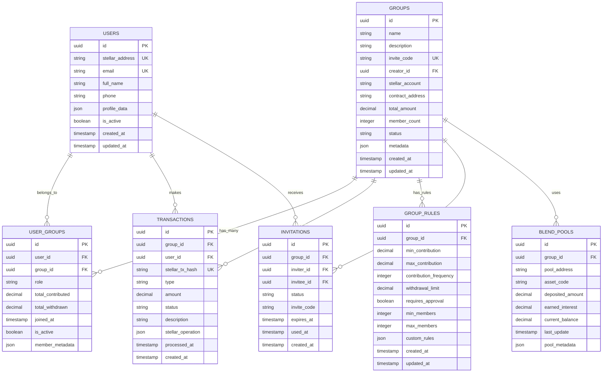

# 🗄️ Esquema de Base de Datos

## Community Wallet - Estructura de Datos

## 📋 Descripción de Tablas

### 👤 USERS

**Usuarios del sistema**

- `stellar_address`: Dirección pública de Stellar del usuario
- `email`: Email para autenticación con Supabase
- `profile_data`: Información adicional del perfil (JSON)
- `is_active`: Estado del usuario

### 👥 GROUPS

**Grupos de ahorro comunitario**

- `invite_code`: Código único para unirse al grupo
- `creator_id`: Usuario que creó el grupo
- `stellar_account`: Cuenta Stellar del grupo (multisig)
- `contract_address`: Dirección del smart contract
- `total_amount`: Monto total acumulado
- `status`: Estado del grupo (active, paused, closed)

### 🔗 USER_GROUPS

**Relación usuarios-grupos**

- `role`: Rol del usuario (admin, member, viewer)
- `total_contributed`: Total aportado por el usuario
- `total_withdrawn`: Total retirado por el usuario
- `member_metadata`: Datos específicos del miembro

### 💰 TRANSACTIONS

**Historial de transacciones**

- `stellar_tx_hash`: Hash de la transacción en Stellar
- `type`: Tipo (contribution, withdrawal, interest)
- `stellar_operation`: Datos completos de la operación
- `status`: Estado (pending, confirmed, failed)

### ⚙️ GROUP_RULES

**Reglas de funcionamiento del grupo**

- `min/max_contribution`: Límites de aportes
- `contribution_frequency`: Frecuencia de aportes
- `withdrawal_limit`: Límite de retiros
- `requires_approval`: Si requiere aprobación
- `custom_rules`: Reglas personalizadas (JSON)

### 📧 INVITATIONS

**Invitaciones a grupos**

- `invite_code`: Código único de invitación
- `expires_at`: Fecha de expiración
- `used_at`: Fecha de uso
- `status`: Estado (pending, used, expired)

### 🏦 BLEND_POOLS

**Integración con Blend Protocol**

- `pool_address`: Dirección del pool en Blend
- `asset_code`: Código del asset (USDC)
- `deposited_amount`: Monto depositado
- `earned_interest`: Intereses ganados
- `current_balance`: Balance actual

## 🔐 Índices y Constraints

### Índices Principales

- `users_stellar_address_idx` (UNIQUE)
- `groups_invite_code_idx` (UNIQUE)
- `transactions_stellar_tx_hash_idx` (UNIQUE)
- `user_groups_user_group_idx` (UNIQUE)

### Constraints

- `users_email_unique`
- `groups_invite_code_unique`
- `transactions_stellar_tx_hash_unique`
- `user_groups_user_id_group_id_unique`

## 🚀 Consideraciones de Rendimiento

- **Particionamiento**: Transacciones por fecha
- **Índices**: Optimización de consultas frecuentes
- **Archivado**: Datos históricos older than 2 años
- **Caching**: Redis para datos frequently accessed
