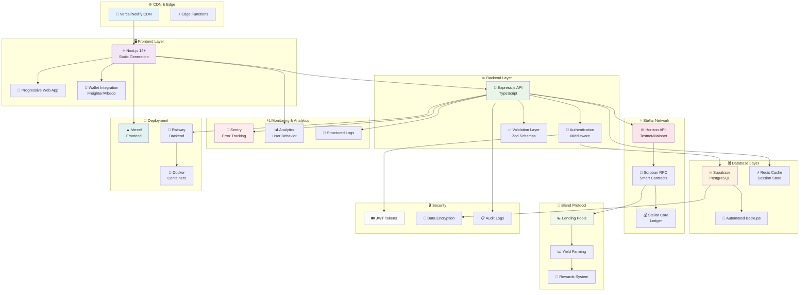

# 🚀 Arquitectura de Deployment

## Community Wallet - Infraestructura de Producción



## 🏗️ Componentes de Infraestructura

### 🌐 Frontend (Next.js)

**Despliegue en Vercel**

- **Static Generation**: Pre-renderizado de páginas
- **Edge Functions**: Funciones serverless en el edge
- **CDN Global**: Distribución mundial de contenido
- **Automatic Deployments**: CI/CD automático desde Git

### 🔙 Backend (Express.js)

**Despliegue en Railway**

- **Containerization**: Docker containers
- **Auto-scaling**: Escalado automático
- **Health Checks**: Monitoreo de salud
- **Rolling Deployments**: Despliegues sin downtime

### 🗄️ Base de Datos

**Supabase PostgreSQL**

- **Managed Database**: Base de datos gestionada
- **Real-time Subscriptions**: Actualizaciones en tiempo real
- **Automated Backups**: Respaldos automáticos
- **Point-in-time Recovery**: Recuperación temporal

### ⚡ Cache & Session

**Redis Cloud**

- **Session Management**: Gestión de sesiones
- **API Caching**: Cache de respuestas API
- **Rate Limiting**: Limitación de requests
- **Pub/Sub**: Mensajería en tiempo real

## 🚀 Estrategia de Deployment

### Ambientes de Desarrollo

#### 🧪 Development

```bash
# Frontend
npm run dev          # http://localhost:3000

# Backend
npm run dev          # http://localhost:5000

# Database
supabase start       # Local Supabase
```

#### 🧪 Staging

```bash
# Vercel Preview
vercel --prod=false

# Railway Staging
railway up --service=api-staging
```

#### 🏭 Production

```bash
# Vercel Production
vercel --prod

# Railway Production
railway up --service=api-production
```

### CI/CD Pipeline

#### GitHub Actions

```yaml
name: Deploy Community Wallet

on:
  push:
    branches: [main]
  pull_request:
    branches: [main]

jobs:
  test:
    runs-on: ubuntu-latest
    steps:
      - uses: actions/checkout@v3
      - name: Setup Node.js
        uses: actions/setup-node@v3
        with:
          node-version: "18"
      - name: Install dependencies
        run: npm ci
      - name: Run tests
        run: npm test
      - name: Run linting
        run: npm run lint

  deploy-frontend:
    needs: test
    runs-on: ubuntu-latest
    if: github.ref == 'refs/heads/main'
    steps:
      - uses: actions/checkout@v3
      - name: Deploy to Vercel
        uses: amondnet/vercel-action@v25
        with:
          vercel-token: ${{ secrets.VERCEL_TOKEN }}
          vercel-org-id: ${{ secrets.ORG_ID }}
          vercel-project-id: ${{ secrets.PROJECT_ID }}

  deploy-backend:
    needs: test
    runs-on: ubuntu-latest
    if: github.ref == 'refs/heads/main'
    steps:
      - uses: actions/checkout@v3
      - name: Deploy to Railway
        uses: bervProject/railway-deploy@v1.0.0
        with:
          railway_token: ${{ secrets.RAILWAY_TOKEN }}
          service: api-production
```

## 🔍 Monitoreo y Observabilidad

### 📊 Métricas de Aplicación

- **Response Time**: Tiempo de respuesta de API
- **Error Rate**: Tasa de errores
- **Throughput**: Requests por segundo
- **Uptime**: Disponibilidad del servicio

### 🐛 Error Tracking

**Sentry Integration**

```javascript
import * as Sentry from "@sentry/nextjs";

Sentry.init({
  dsn: process.env.SENTRY_DSN,
  environment: process.env.NODE_ENV,
  tracesSampleRate: 1.0,
});
```

### 📈 Analytics

**Google Analytics / Mixpanel**

- **User Behavior**: Comportamiento de usuarios
- **Conversion Funnel**: Embudo de conversión
- **Group Creation**: Creación de grupos
- **Transaction Volume**: Volumen de transacciones

### 📝 Logging

**Structured Logging**

```javascript
const logger = winston.createLogger({
  level: "info",
  format: winston.format.json(),
  transports: [
    new winston.transports.File({ filename: "error.log", level: "error" }),
    new winston.transports.File({ filename: "combined.log" }),
  ],
});
```

## 🔒 Seguridad en Producción

### 🛡️ Security Headers

```javascript
// Security middleware
app.use(
  helmet({
    contentSecurityPolicy: {
      directives: {
        defaultSrc: ["'self'"],
        styleSrc: ["'self'", "'unsafe-inline'"],
        scriptSrc: ["'self'"],
        imgSrc: ["'self'", "data:", "https:"],
      },
    },
  })
);
```

### 🔐 Environment Variables

```bash
# Production Environment
NODE_ENV=production
DATABASE_URL=postgresql://...
REDIS_URL=redis://...
JWT_SECRET=...
STELLAR_NETWORK=public
SUPABASE_URL=...
SUPABASE_ANON_KEY=...
SENTRY_DSN=...
```

### 🚨 Security Best Practices

- **HTTPS Only**: Conexiones seguras obligatorias
- **CORS Configuration**: Configuración restrictiva de CORS
- **Rate Limiting**: Limitación de requests por IP
- **Input Validation**: Validación estricta de inputs
- **SQL Injection Prevention**: Uso de queries parametrizadas
- **XSS Protection**: Sanitización de inputs

## 📊 Escalabilidad y Performance

### 🔄 Auto-scaling

- **Horizontal Scaling**: Múltiples instancias
- **Load Balancing**: Distribución de carga
- **Database Scaling**: Read replicas
- **Cache Strategies**: Estrategias de cache

### ⚡ Performance Optimization

- **Code Splitting**: División de código
- **Image Optimization**: Optimización de imágenes
- **Bundle Analysis**: Análisis de bundles
- **CDN Optimization**: Optimización de CDN

### 💾 Backup & Recovery

- **Automated Backups**: Respaldos automáticos diarios
- **Point-in-time Recovery**: Recuperación temporal
- **Disaster Recovery**: Plan de recuperación
- **Data Retention**: Políticas de retención
