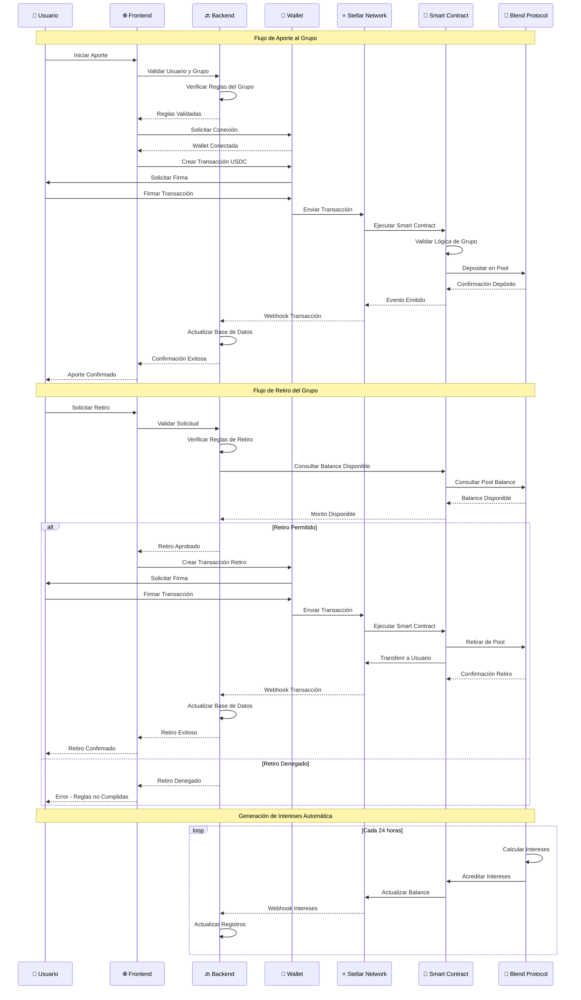

# ⭐ Integración Stellar & Blend Protocol

## Community Wallet - Flujo de Transacciones



## 🔧 Componentes de Integración

### ⭐ Stellar Network

**Blockchain principal para transacciones**

- **Red**: Testnet (desarrollo), Mainnet (producción)
- **Asset**: USDC como token principal
- **Cuentas**: Multisignatura para grupos
- **Operaciones**: Payments, Create Account, Set Options

### 📄 Smart Contracts (Soroban)

**Lógica de negocio en blockchain**

- **Grupo Management**: Crear, configurar, gestionar grupos
- **Validaciones**: Reglas de aportes y retiros
- **Eventos**: Notificaciones de transacciones
- **Integración Blend**: Conexión con protocolo DeFi

### 🏦 Blend Protocol

**Protocolo DeFi para generar intereses**

- **Lending Pools**: Depósitos que generan intereses
- **Yield Farming**: Estrategias de rendimiento
- **Liquidez**: Gestión de liquidez automática
- **Rewards**: Distribución de rewards

## 💰 Flujos de Transacciones

### 1. Aporte al Grupo

```
Usuario → Wallet → Stellar → Smart Contract → Blend Pool
```

1. Usuario autoriza transacción en wallet
2. Stellar procesa payment a smart contract
3. Smart contract valida reglas del grupo
4. Fondos se depositan en Blend pool
5. Se acredita balance al grupo

### 2. Retiro del Grupo

```
Usuario → Validación → Smart Contract → Blend Pool → Usuario
```

1. Usuario solicita retiro
2. Smart contract valida reglas
3. Se retiran fondos de Blend pool
4. Se transfieren fondos al usuario
5. Se actualiza balance del grupo

### 3. Generación de Intereses

```
Blend Pool → Intereses → Smart Contract → Balance Grupo
```

1. Blend calcula intereses diarios
2. Se acreditan a la cuenta del grupo
3. Smart contract actualiza balances
4. Se distribuyen según reglas

## 🔐 Seguridad y Validaciones

### Validaciones de Smart Contract

- **Membership**: Usuario debe ser miembro del grupo
- **Minimum Amount**: Aportes mínimos requeridos
- **Maximum Amount**: Límites de aportes/retiros
- **Frequency**: Respeto a frecuencia de aportes
- **Consensus**: Aprobación de mayoría si requerida

### Seguridad de Fondos

- **Multisignatura**: Cuentas requieren múltiples firmas
- **Time Locks**: Bloqueos temporales en retiros
- **Audit Trail**: Historial completo de transacciones
- **Emergency Pause**: Capacidad de pausar contratos

## 🚀 Configuración Técnica

### Stellar SDK Integration

```javascript
import { StellarSdk } from "stellar-sdk";

const server = new StellarSdk.Server("https://horizon-testnet.stellar.org");
const networkPassphrase = StellarSdk.Networks.TESTNET;
```

### Blend Protocol Integration

```javascript
import { BlendClient } from "@blend-capital/blend-sdk";

const blendClient = new BlendClient({
  rpcUrl: "https://soroban-testnet.stellar.org",
  networkPassphrase: StellarSdk.Networks.TESTNET,
});
```

### Smart Contract Deployment

```bash
stellar contract deploy \
  --wasm community-wallet.wasm \
  --source-account ADMIN_SECRET \
  --network testnet
```

## 📊 Monitoreo y Métricas

### Métricas Clave

- **Total Value Locked (TVL)**: Valor total en pools
- **Active Groups**: Grupos activos
- **Transaction Volume**: Volumen de transacciones
- **Yield Generated**: Rendimientos generados
- **User Retention**: Retención de usuarios

### Alertas y Monitoreo

- **Failed Transactions**: Transacciones fallidas
- **Low Liquidity**: Liquidez insuficiente
- **High Slippage**: Deslizamiento alto
- **Contract Errors**: Errores en smart contracts
