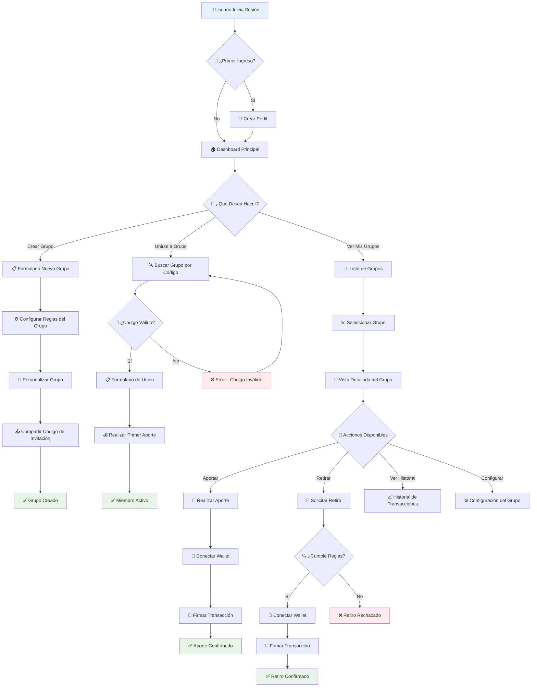

# 👤 Diagrama de Flujo de Usuario

## Community Wallet - Experiencia de Usuario

## 🎯 Casos de Uso Principales

### 1. Crear Grupo de Ahorro

- **Administrador** define reglas y configuración
- **Sistema** genera código de invitación único
- **Administrador** comparte código con miembros

### 2. Unirse a Grupo

- **Usuario** introduce código de invitación
- **Sistema** valida código y permisos
- **Usuario** realiza primer aporte obligatorio

### 3. Realizar Transacciones

- **Aportes**: Transferencia desde wallet personal
- **Retiros**: Validación de reglas y consenso
- **Intereses**: Generación automática via Blend

### 4. Gestión de Grupo

- **Historial**: Visualización de transacciones
- **Configuración**: Modificar reglas (solo admin)
- **Notificaciones**: Eventos importantes

## 🔒 Validaciones de Seguridad

- **Autenticación**: Supabase Auth + Stellar wallet
- **Autorización**: Roles y permisos por grupo
- **Transacciones**: Firmas digitales obligatorias
- **Reglas**: Validación automática de retiros
